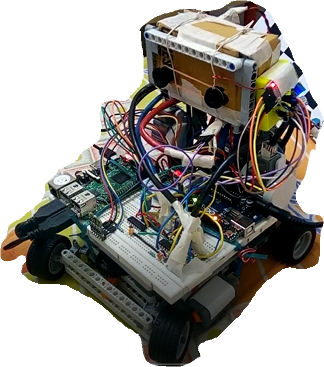

# STRIDER
Home of the Simplified Teaching & Research Implementation of Driverless Exploration Rover Project

This repository hosts the GitHub pages for the STRIDER project.
The intent behind this project is to develop an open source hardware project
that will server as an education platform for teaching about autonomous vehicles.

More details will be added shortly.
